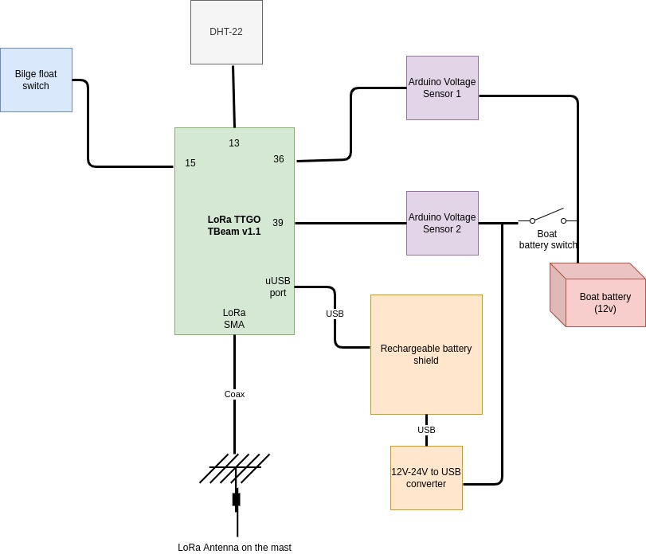

# TTN Boat Sensor

Project forked from https://github.com/kizniche/ttgo-tbeam-ttn-tracker.

This project intends to create a boat LoRa sensor station to get several metrics and send them via TTN. In this release the sensor station gathers and sends the following variables:

* Boat's battery level
* Whether the battery of the boat is turned on
* Humidity and temperature
* GPS position
* Status of a float switch. A floating switch is placed at the bottom of the bilge.

This sensor station will be placed inside a boat, so its enclosure must be water and corrosion resistant. It must be also well fixed to the boat so it does not move or fall when sailing, as it could cause several damage to other components of the boat. Space in boats is limited, so it must be easy to unmount (we don't want to remove meters of cable inside the bilge if we have to remove it temporally). In addition, two antennas will be placed on top of the mast, because GPS and LoRa signals may be blocked or attenuated by the deck.

The main electrical components will be detached from the main battery of the boat because it must be working all the time and we don't want it to eventually drain the battery of the boat. For this reason electronics will use a different power source, so we have also to be sure that electronics use as little power as possible. Anyway, when the battery of the boat is connected, it will charge the batteries of the electronics.

## Components

* [TTGO Lora T-BEAM V1.1] (https://www.aliexpress.com/item/32875743018.html)
* Float switch [like this one] (https://www.aliexpress.com/item/33004754249.html)
* DHT-22 humidity and temperature sensor
* 2x Arduino [voltage sensor](https://www.aliexpress.com/item/1005002235375607.html)
* 12V-24V to USB converter.
* Powerbank or battery shield (optional, only intended for more battery life) 
* Plastic or fiber case of at least 28x35cm
* Din rail
* Li-ION Rechargeable batteries
* Cable, connectors, zip ties...

# Software

WIP

# Electrical diagram

