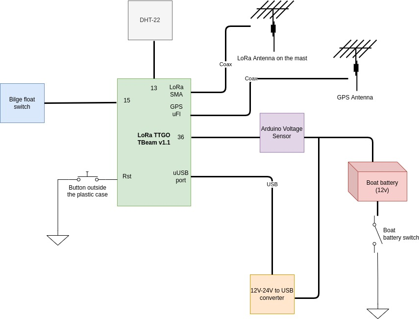

# TTN Boat Sensor

- [Introduction](#introduction)
- [Hardware list](#hardware-list)
- [Sofware dependencies](#software-dependencies)
- [Design](#design)
- [Electrical diagram](#electrical-diagram)


# Introduction

Project forked from https://github.com/kizniche/ttgo-tbeam-ttn-tracker.

This project intends to create a boat LoRa sensor station to get several metrics and send them via TTN. In this release the sensor station gathers and sends the following variables:

* Boat's battery level
* Whether the battery of the boat is turned on
* Humidity and temperature
* GPS position
* Status of a float switch. A floating switch is placed at the bottom of the bilge to detect if there's a huge amount of water and needs attention.

Then the program sends all these variables via TTN.

## Specific requeriments

This sensor station will be placed inside a boat, so its enclosure must be water and corrosion resistant. It must be also well fixed to the boat so it does not move or fall when sailing, as it could cause several damage to other components of the boat. Space in boats is limited, so it must be easy to unmount (we don't want to remove meters of cable inside the bilge if we have to remove it temporally). In addition, two antennas will be placed on top of the mast, because GPS and LoRa signals may be blocked or attenuated by the deck.

The main electrical components will be detached from the main battery of the boat because it must be working all the time and we don't want it to eventually drain the battery of the boat. For this reason electronics will use a different power source, so we have also to be sure that electronics use as little power as possible. Anyway, when the battery of the boat is connected, it will charge the batteries of the electronics.

To save power we need to do some logic. Apart from tuning the deep sleep time it will only get and send GPS data if we're connected to the main power. We're doing this to prevent GPS to drain the battery too quickly, as waiting for the GPS to be ready consumes a lot of time.

# Hardware list

Check list:

- LoRa Board [TTGO Lora T-BEAM V1.1](https://www.aliexpress.com/item/32875743018.html)
- Float switch [like this one](https://www.aliexpress.com/item/33004754249.html)
- [DHT-22 humidity and temperature sensor](https://es.aliexpress.com/item/32901733917.html)
- Arduino [voltage sensor](https://www.aliexpress.com/item/1005002235375607.html)
- [12V-24V to USB converter](https://www.amazon.es/TECNOIOT-6-24V-Module-DC-DC-Converter/dp/B07JLTTZXL)
- Plastic or fiber case of at least 28x35cm
- Din rail (recommended)
- Li-ION Rechargeable batteries (one at least)
- SMA Male to Female Pigtals and cables.
- USB cables, wiring cable, connectors, zip ties...
- Powerbank or battery shield (optional, only intended for more battery life) 
- 10k Ohms resistor and small PCB

# Software dependencies

Install Arduino IDE and libraries listed in https://github.com/kizniche/ttgo-tbeam-ttn-tracker:

- Espressif/arduino-esp32 board for Arduino IDE as specified in https://github.com/espressif/arduino-esp32.
- mcci-catena/arduino-lmic (for Rev0 and Rev1)
- mikalhart/TinyGPSPlus (for Rev0 and Rev1)
- lewisxhe/AXP202X_Library (for Rev1 only)
- Only if you want to add the OLED SSD screen: ThingPulse/esp8266-oled-ssd1306 (for Rev0 and Rev1)

# Design

## Mounting considerations

Example of case mount:


Some considerations:

**Din Rail**. Optional, but consider having things well fixed.

**Power**. You may connect a powerbank or some kind of extra battery to the board if needed. Only one 18650 battery may not be enough.

**Reset buttons**. Installed some reset buttons outside the plastic case so resetting the board and the future powerbanks is easier.

**Power distribution**. Added power distribution blocks on DIN rails to avoid cable joints.

**SMA connections**. Drilled small holes to the top of the case to screw SMA females. This way you can unmount the case when needed without removing all the cable all along the boat.

**Bilge switch resistor**. Added a 10k Ohms resistor soldered on a small chunk of PCB for the bilge switch.

**DHT22**. Place it outside the box so it gets the real environment values!

## Program flow
The program simply loops and takes a deep sleep and wakes up as specified in the `SEND_INTERVAL`. When waking up the program initializes all peripherals and checks if it's connected to the main power. The program checks if we are connected to the main power and if so waits for the GPS for `GPS_WAIT_FOR_LOCK` seconds. If it is not connected to the main power it won't wait for the GPS and simply will send the LoRa packet instantly.

To calculate the deep sleep time substracts the `GPS_WAIT_FOR_LOCK` value to `SEND_INTERVAL`.

## LoRa Packet structure

LoRa Packet structure takes only 9 bytes (1 unused) and is as follows:

```
 0                   1                   2                   3  
 0 1 2 3 4 5 6 7 8 9 0 1 2 3 4 5 6 7 8 9 0 1 2 3 4 5 6 7 8 9 0 1
+-+-+-+-+-+-+-+-+-+-+-+-+-+-+-+-+-+-+-+-+-+-+-+-+-+-+-+-+-+-+-+-+
|                Encoded Latitude               |               |
+-+-+-+-+-+-+-+-+-+-+-+-+-+-+-+-+-+-+-+-+-+-+-+-+-+-+-+-+-+-+-+-+
|       Encoded Longitude       |G|   Humidity  |    Temp   |B|S|
+-+-+-+-+-+-+-+-+-+-+-+-+-+-+-+-+-+-+-+-+-+-+-+-+-+-+-+-+-+-+-+-+
|  Btt voltage  |     Unused    |
+-+-+-+-+-+-+-+-+-+-+-+-+-+-+-+-+
```

(ASCII created thanks to https://github.com/luismartingarcia/protocol.git)

Where: 
- G is whether GPS is valid
- B is whether battery is on
- S is whether the bilge switch is on.
- Btt voltage is the voltage of the boat battery

## Pinout

Not all pins from the board TTGO T-Beam work so we had to find the ones available. In fact a lot of them are wired to board peripherals like GPS module or LoRa, so they are not easy to change or expand.

- Pin VP or 36: voltage sensor
- Pin 13: DHT22 sensor
- Pin 15: Bilge switch pin: 
- Pin Rst: Reset button

# Mounting the case on the boat

Still WIP!

# Electrical diagram


